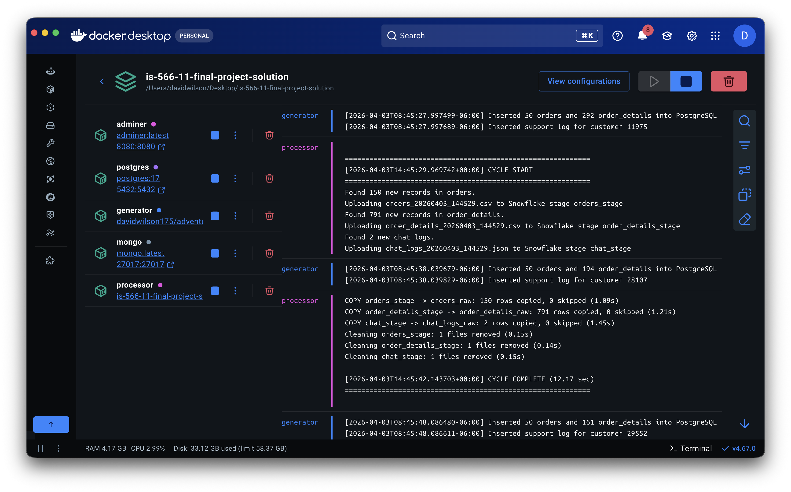
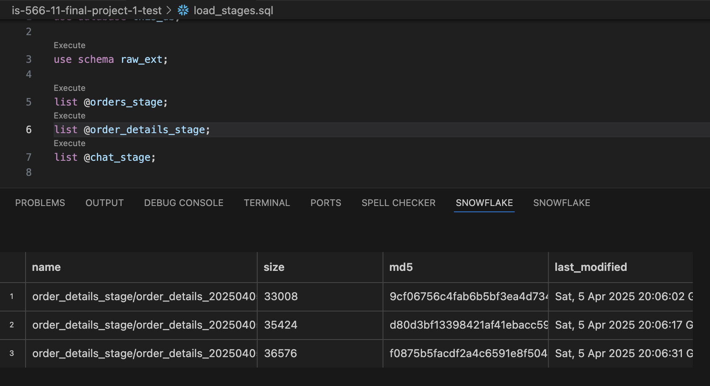
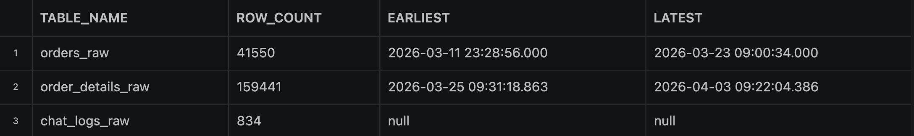
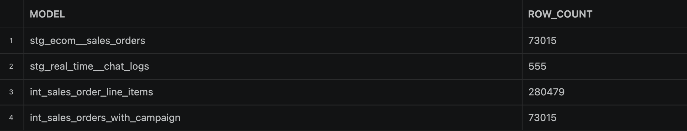
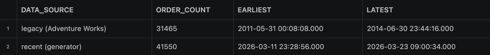
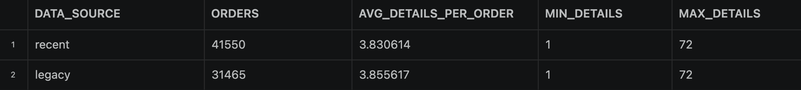
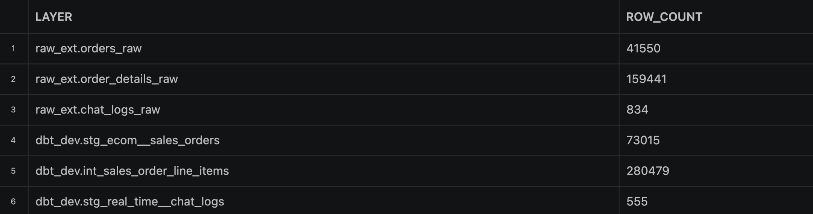
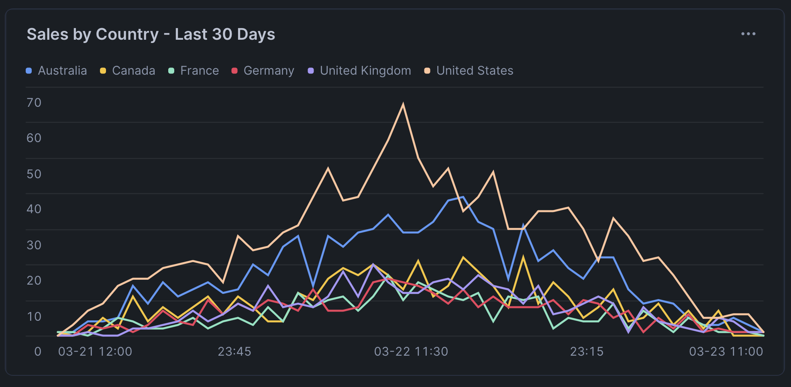

# Final Project // Milestone 1: Full-Stack Data Pipeline Integration

Well, my friends. We're here. The journey has been long and arduous, but we've learned a lot along the way. And to help you demonstrate (to me, a future interviewer, and most importantly, to _yourself_) that you have indeed learned _a ton_ here in this class, this final project will bring it all together in a single flow. This project (across the three milestones) will be your finest work yet, and something you will be proud and excited to talk about with your future employers.

As you might expect, this project will flow a bit differently compared to the labs we've worked on. Each of those labs was an extremely detailed, close-up view of how to use a particular technology to accomplish something that relates to data engineering. There was plenty of "learn by doing" in which I asked you to explore some things, teach yourself about how to accomplish something, and gave you fairly particular requirements about what the end product should look like.

By contrast, this project will be much more "zoomed out", and you'll be asked to build various components of a full data pipeline with much less guidance from me. Nearly everything I'm asking you to do will be something that we have already done in a prior lab assignment. (The few new things I'm adding in will be accompanied by some detailed examples and a video walkthrough explaining anything you need to know.)

## Project Scenario

My plan is to treat this project like a real-world data team project. I will be acting as your manager, and you'll be given tasks that I would ask a junior member of my team to accomplish. In a real-world project, managers don't usually do a lot of hand-holding (nor do you want them to!). Instead, a good manager will ask you to work on something, give clear guidelines and context about what you're supposed to accomplish and why, but not get lost in the details. Very soon, you'll join a team in the workforce, and this is 100% the type of situation you'll find yourself in. So we're going to give you some exposure to that.

As usual, I've broken down the milestone into five key tasks. For each, I'll describe the goal in managerial terms and list specific objectives you should meet. Remember, these are high-level requirements, and you'll need to determine how to achieve them using the skills and tools you've acquired over the course of the semester.

And here's a rough idea of what the ending file system looks like. As you'll find out below, I'm not being prescriptive about how you name things, so this is just here in case it's helpful.

```bash
is-566-11-final-project-1
├─ README.md
├─ compose.yml
├─ .env.sample
├─ dbt
│ ├─ analyses
│ │ ├─ campaign_sales_analysis.sql
│ │ └─ email_campaign_performance.sql
│ ├─ dbt_project.yml
│ ├─ models-m1
│ │ ├─ intermediate
│ │ │  ├─ int_sales_order_line_items.sql
│ │ │  ├─ int_sales_orders_with_campaign.sql
│ │ │  └─ int_sales_order_with_customers.sql    # <-- Task 4
│ │ ├─ models.yml
│ │ └─ staging
│ │    ├─ adventure_db
│ │    │  ├─ stg_adventure_db__customers.sql
│ │    │  ├─ stg_adventure_db__inventory.sql
│ │    │  ├─ stg_adventure_db__product_vendors.sql
│ │    │  ├─ stg_adventure_db__products.sql
│ │    │  └─ stg_adventure_db__vendors.sql
│ │    ├─ ecom
│ │    │  ├─ base
│ │    │  │  ├─ base_ecom__email_campaigns.sql
│ │    │  │  ├─ base_ecom__email_mktg_new.sql
│ │    │  │  └─ base_ecom__sales_orders.sql
│ │    │  ├─ stg_ecom__email_campaigns.sql
│ │    │  ├─ stg_ecom__purchase_orders.sql
│ │    │  └─ stg_ecom__sales_orders.sql          # <-- Task 3
│ │    ├─ real_time                              # <-- Task 3
│ │    │  ├─ base                                # <-- Task 3
│ │    │  │  └─ base_real_time__sales_orders.sql # <-- Task 3
│ │    │  └─ stg_real_time__chat_logs.sql        # <-- Task 3
│ │    └─ sources.yml                            # <-- Task 3
│ ├─ seeds
│ │ ├─ _seeds.yml
│ │ ├─ measures.csv
│ │ └─ ship_method.csv
│ └─ tests
│   ├─ no_negative_inventory_amounts.sql
│   ├─ preferred_vendors_have_credit.sql
│   ├─ products_sell_end_date_is_null.sql
│   └─ single_conversion_per_order.sql
├─ sql
│ ├─ check_data_flow_queries.sql
│ └─ create_raw_tables.sql                             # <-- Task 2
├─ processor
│ ├─ Dockerfile                # <-- Task 1
│ ├─ etl
│ │ ├─ extract.py
│ │ └─ load.py                 # <-- Tasks 1 & 2
│ ├─ init.sql
│ ├─ main.py                   # <-- Tasks 1 & 2
│ ├─ pyproject.toml
│ └─ utils
│   ├─ connections.py
│   ├─ env_loader.py
│   └─ watermark.py
├─ scratch.sql
└─ screenshots
```

> [!TIP]
> Despite my desire for this to feel like a real-world project and encouraging you to use some autonomy, that doesn't mean I'm not here to help. As usual, we'll try to balance this appropriately. But you'll be free to choose how you go about your solution without strict guidelines, and I'll plan to just be around to answer questions, help troubleshoot, etc.
>
> Note also: Unlike the last dbt lab, there are no tricks or "gotcha's" built into this assignment (at least not intentionally...). I'm much more interested in you _making it through_ the full data pipeline experience rather than experiencing some real-world pain along the way.

I couldn't be more excited for you. Let's do it.

---

## Task 1: Containerized Python ETL Microservice

Our team needs a lightweight ETL microservice to regularly collect data from two production systems and prepare it for our data warehouse. I'm tasking you with building a Python-based ETL process that connects to our two transactional databases (one PostgreSQL, one MongoDB), extracts the latest data, and lands it into an internal Snowflake stage for further processing. This service must be packaged as a Docker container to align with our deployment standards. We have some existing utility code to get you started, but you'll need to understand that codebase and integrate your work into it. Treat this as if you're joining an ongoing project, the framework is there, and you're adding a new component to meet our goals.

The processor will also handle loading and cleanup in Task 2, so this task focuses on getting extraction and staging working correctly first.

- **Build a Python ETL process**: Develop a script or module that connects to the PostgreSQL and MongoDB sources and retrieves the required data (e.g. recent transactions related to our multi-week Adventure data scenario). Ensure the ETL logic can handle data from both sources and format it as needed for loading. There are two sales tables to extract from the PostgreSQL database, and one chat logs collection to extract from MongoDB. Each of these three extractions can be placed in their own stage on Snowflake. (In other words, this python script doesn't need to do any combining; we'll take care of that with dbt downstream.)

> [!TIP]
> Part of the trick to properly pulling data from the two databases will entail using some timestamps and a "watermark" strategy to ensure that you only pull the data that has been added since the last time you queried that particular table. This will likely be a new concept for many, and you can read about the approach [here](https://chatgpt.com/share/67ee02e0-8d58-8010-a090-fb2cae0af5d6). I have provided the functions to implement this strategy, but here is one very helpful tip that will save you a lot of troubleshooting: notice that the two `extract_` functions will filter the data based on a column _in the table/collection that is being queried_. Given this, it would be a good idea to derive your new "watermark" timestamp from the data that you pull down each time (rather than, say, getting the current system time using a `datetime` function). This way, you're always trusting in the same source of timestamps (i.e., the generator service) to compare along a single linear timeline. (Cue the Loki reference!)

- **Use provided code framework**: You'll want to carefully review and understand the provided utility code (e.g. database connection helpers, config loaders, etc.). You'll be integrating your ETL logic into this existing codebase rather than starting from scratch, _just like you would do if you joined a real data team_. This will require you to read and understand the existing code structure and follow the project's coding conventions.

> [!IMPORTANT]
> **Snowflake PAT Authentication**: Since we use Programmatic Access Tokens (PATs) for Snowflake authentication, the `SNOWFLAKE_ROLE` variable in your `.env` is **required**, not optional. Without it, your Snowflake session will default to a role that cannot access the database. Make sure this is set to your assigned role (e.g. `BADGER_ROLE` or whatever role your account uses).

> [!TIP]
> During development, set `PROCESSOR_INTERVAL_SEC=0` in your `.env` to make the processor run one cycle and exit. This is much faster for testing than waiting for the default 5-minute interval. Set it back to `300` (or another value) when you want continuous operation.

- **Export to Snowflake stage**: After extraction (and without really doing any transformations unless you find you need them), the processor should load the data into an internal Snowflake stage. You'll see that there are already utility functions that will handle this for you, including some suggested names for the stages and the schema where you will be landing this data. Ensure that the data from both Postgres and MongoDB sources end up as staged files ready for Snowflake to ingest.
- **Containerize with Docker**: Write a Dockerfile and containerize the entire ETL service. Include all necessary dependencies (Python libraries for PostgreSQL, MongoDB, Snowflake, etc.) in the image. The container should then be configured to run inside the provided Docker Compose environment to ensure that it could run in our company's cloud-based container environment (which is outside the scope of this class...but I'm just making up some context).
- **Test the microservice independently**: Run your containerized ETL service to verify it pulls data correctly from both databases and uploads files to the Snowflake stage. Debug any issues with connectivity (e.g. verifying that the credentials for Postgres and Mongo work as intended both locally and in the Docker Compose environment) and ensure the container logs or outputs indicate that the environment can remain running (if so configured) to constantly generate, process, and load data. The goal is a repeatable ETL process that the rest of our pipeline can depend on.

> [!IMPORTANT]
> The deliverable(s) for milestone 3 will be a few short audio recordings of you explaining your system in action. You'll obviously need to submit your code for each Milestone via GitHub by the associated due date, but you will wait to create the recording until I give you some clear direction on how to do so as a part of Milestone 3. For now, you should just carefully doublecheck that this task is doing exactly what has been requested in the high-level instructions.
>
> You'll know that your Task 1 is done when you:
> 1. Have both the generator and processor running, seeing records consistently processed (but not consistently increasing, meaning that you're only pulling and processing new records). If you look at the logs for the processor container in Docker Desktop, you will likely see something similar to the first screenshot below.)



> [!TIP]
> Simplify your `.env` setup. The starter code uses separate `.env` files for local dev and Docker (`.env.dev` and `.env.docker`), which means maintaining duplicate credentials. You can eliminate this by using a single `.env` at the project root, as follows:
> 
> In `compose.yml`, point the processor's `env_file` at the root `.env` and remove the `--env` flag from the command:
> 
> ```yaml
> processor:
>   env_file:
>     - .env
>   command: ["uv", "run", "python", "main.py"]
> ```
> 
> In `processor/utils/env_loader.py`, make the file argument optional so it works both locally and in Docker:
> 
> ```python
> def load_environment():
>     parser = argparse.ArgumentParser()
>     parser.add_argument("--env", default=None, help="Path to .env file")
>     args, _ = parser.parse_known_args()
> 
>     if args.env:
>         if not os.path.exists(args.env):
>             raise FileNotFoundError(f".env file not found at {args.env}")
>         load_dotenv(dotenv_path=args.env)
>     else:
>         load_dotenv()  # loads .env from cwd if present, no-op if absent
> ```
> 
> This works because Compose's `env_file` injects variables into the container's environment before your process starts — no file needs to exist inside the container. Locally, you can run `python main.py --env ../../.env` or just run from the project root.


---

## Task 2: Processor-Driven Loading and Stage Cleanup

With data now landing in the Snowflake stages, we need to get those staged files into raw tables so they can feed our dbt models downstream. In many production environments, orchestration tools like Airflow or Prefect handle this loading step. For our project, the Python processor itself will handle loading (COPY INTO) and cleanup (REMOVE) directly, which is simpler and gives us full control of the data lifecycle in one place.

### 2.1: Create Raw Tables

Before the processor can load data, you need raw tables ready to receive it. Use the provided `sql/create_raw_tables.sql` as a reference for the table schemas, and create these three tables manually in Snowflake. (If you want to make your life easier for testing later, you could also ask AI to help you automate the creation of those tables as a part of the `load.py` functionality, but that's up to you. It would make it easier to drop your whole data flow and then recreate both the stages and raw tables in the `RAW_EXT` schema. Not required, but maybe convenient.)

> [!TIP]
> Use `sql/create_raw_tables.sql` as a reference for the table schemas. The columns match the data your processor extracts.

### 2.2: Implement the Load and Cleanup Functions

The processor's `load.py` module contains three functions. The first one — `upload_dataframe_to_stage()` — is already fully implemented and handles writing DataFrames to CSV/JSON and PUTting them into a Snowflake stage.

The other two are stubs that you need to implement:

- **`copy_stage_to_table()`** — Execute a Snowflake COPY INTO command to load staged files into a raw table. Must handle both CSV and JSON formats and return a metrics dict with `rows_copied`, `rows_skipped`, `execution_time_sec`, `status`, and `error_message`.
- **`clean_stage()`** — Execute a Snowflake REMOVE command to delete staged files after successful loading. Return a metrics dict with `files_removed`, `execution_time_sec`, `status`, and `error_message`.

The function signatures, docstrings, and return contracts are already defined — read them carefully. After implementing these two functions, you'll also need to complete the TODO in `main.py` that loops through the three stages and calls your functions. The extract section and stage list are already provided — you just need to wire up the copy and cleanup calls.

> [!TIP]
> Snowflake's [COPY INTO](https://docs.snowflake.com/en/sql-reference/sql/copy-into-table) and [REMOVE](https://docs.snowflake.com/en/sql-reference/sql/remove) documentation will be your best friends here. You can also use AI assistance — share the function signatures and docstrings with your agent and ask it to implement the logic.

Make sure your `.env` has these set to `true`:
- `PROCESSOR_ENABLE_COPY_INTO=true`
- `PROCESSOR_ENABLE_CLEANUP=true`

The full processor cycle runs in this order:

1. Extract and stage orders
2. Extract and stage order_details
3. Extract and stage chats
4. Copy orders_stage -> orders_raw
5. Copy order_details_stage -> order_details_raw
6. Copy chat_stage -> chat_logs_raw
7. Clean all three stages
8. Log metrics

> [!TIP]
> 1. Your orchestration code should implement a smart pattern: if COPY INTO fails for a stage, skip cleanup for that stage so the files stay available for retry on the next cycle. Store each copy result and check `result["status"]` before cleaning.
> 2. You can run a `list @orders_stage`, `list @order_details_stage`, and `list @chat_stage` and see files staged there (and being constantly added, given the activity in #1 above). To be extra sure, you may want to: (a) turn off the `PROCESSOR_ENABLE_CLEANUP` variable in the .env file, (b) manually run `remove @orders_stage`, etc., and then make sure that the files being _currently_ generated are landing there in each stage. (See the screenshot below for a glimpse of what it should look like when you've run a `list` command after loading and before clearing out the stage with `remove`.)



### 2.3: Test the Full Cycle

Once you've implemented the functions, rebuild the Docker image and start all services:

```bash
docker compose up --build
```

> [!WARNING]
> **Snowflake credit usage:** Every time the processor runs a cycle, it uses your Snowflake warehouse (which costs credits). The default `PROCESSOR_INTERVAL_SEC=0` runs one cycle and exits — this is the safest option during development. If you change it to `300` for continuous operation, the processor and generator will automatically shut down after 1 hour (`PROCESSOR_MAX_RUNTIME_SEC=3600` in `.env`). You can change this timeout or set it to `0` to run indefinitely — but **remember to stop it when you're done** (`docker compose down`). Your warehouse has resource monitors attached which will limit your daily credit consumption, and your warehouse will auto-suspend for the day if you exceed a reasonable usage threshold.

Monitor the processor logs. You should see output similar to this for each cycle:

```
============================================================
[2026-03-21T14:30:00+00:00] CYCLE START
============================================================
Found 1234 new records in orders.
Uploading orders_20260321_143000.csv to Snowflake stage orders_stage
Found 5678 new records in order_details.
Uploading order_details_20260321_143000.csv to Snowflake stage order_details_stage
Found 89 new chat logs.
Uploading chat_logs_20260321_143000.json to Snowflake stage chat_stage
COPY orders_stage -> orders_raw: 1234 rows copied, 0 skipped (1.2s)
COPY order_details_stage -> order_details_raw: 5678 rows copied, 0 skipped (1.8s)
COPY chat_stage -> chat_logs_raw: 89 rows copied, 0 skipped (0.6s)
Cleaning orders_stage: 1 files removed (0.3s)
Cleaning order_details_stage: 1 files removed (0.3s)
Cleaning chat_stage: 1 files removed (0.2s)

[2026-03-21T14:30:07+00:00] CYCLE COMPLETE (7.2 sec)
============================================================
```

Verify data is flowing by querying the raw tables:

```sql
SELECT COUNT(*) FROM raw_ext.orders_raw;
SELECT COUNT(*) FROM raw_ext.order_details_raw;
SELECT COUNT(*) FROM raw_ext.chat_logs_raw;
```

And confirm stages are empty after cleanup:

```sql
LIST @orders_stage;
LIST @order_details_stage;
LIST @chat_stage;
```

> [!IMPORTANT]
> 📷 Grab a screenshot of the processor logs showing a complete cycle (extract, stage, copy, cleanup). (And please make sure that the screenshot actually captures the `processor` container output, not the other noise from other containers.) Save this screenshot as `m1_task2.3.png` (or jpg) to the `screenshots` folder in the assignment repository.

**Success Criteria:**
- Raw tables exist in Snowflake and are being populated.
- Processor logs show successful COPY INTO and REMOVE operations.
- Stages are empty after each cycle (files are cleaned up after loading).
- No Snowflake Tasks have been created.

---

## Task 3: dbt Integration

Now that the raw data from our two sources is flowing into Snowflake automatically, we need to integrate it into our warehouse model. Use dbt to create models that incorporate this raw data into the existing warehouse flow, following the same general workflow (base, stage, intermediate). This step is where you apply your data modeling skills to join, clean, and prepare the data to be incorporated into an intermediate, analysis-focused view. (The specific use case driving this modeling is a sales-monitoring dashboard for the last 30 days of sales, which you'll be building in the next task.) Your job is to use what you have learned about using dbt to incorporate these new sources of data into the broader warehouse environment.

> [!TIP]
> Unlike the last lab assignment, you don't need to worry about whether these builds happen in `dev` or `prod`. We won't use dbt Cloud until Milestone 2, so there's no need to keep track of which one you're building in. I've intentionally pulled the dbt setup from the _solution_ to the dbt Cloud assignment so that you shouldn't need to change anything in the project or connection profiles. This means that you're almost certainly going to be applying any model changes to the `dbt_dev` schema in your database when you use `dbt build`. (Just sharing this in case it helps you know where to go look for the tables you'll be building out in this task.)

- **Configure sources for new data**: Update your dbt project to declare the new raw data as sources.
- **Develop base/staging models**: Create (or adapt existing) base/staging models that select from the raw source data and apply initial transformations/cleaning. Use the same conventions that we have been using in the last two projects, and make smart decisions that you could easily justify. The chat logs can go wherever you'd like them to go, but the two sales tables coming out of the PostgreSQL need to be formatted carefully so that they can be added to the existing sales table and downstream flow. Usually this type of integration formatting would happen early in the data flow (i.e., in the base table) so that we keep downstream stg and intermediate tables untouched if possible.

>[!TIP]
> 1. To be clear, both tables of sales data that are coming out of your docker environment should be carefully added to the existing `stg_ecom__sales_orders` model from the last few weeks, potentially using some intermediary formatting in the associated base table(s). This will require you to (a) be very particular about the format and order of the columns, and (b) figure out how to nest the order detail data into the `order_detail` column that is found in the `stg_ecom__sales_orders` table. (You're essentially going to have to do a lateral flatten in reverse, if that makes sense.) To help narrow your search for how to get this done, I would look into the `ARRAY_AGG()` function.
> 
> 2. Note also that, for various reasons, the sales data coming out of the generator system do NOT have any delivery estimate information. This is expected. That column can be empty for the records you're generating for this lab.

- **Adhere to dbt best practices**: Organize your models properly in the project structure, probably using the same hierarchy that we've already been using. Again, your goal is to integrate your new functionality into the existing flow of data. (And you can use my directory tree up above if that helps, but you don't have to follow it exactly.)
- **Test and iterate**: Run your dbt models to materialize the new tables, and verify the results. Check that the data looks correct (especially that your newly added data is showing up). The data being generated in the docker environment has _current_ dates, so this will be easy to verify. I have provided a few of sample queries to help you make sure you got this right: see the `sql/check_data_flow_queries.sql` file in the repository. 

> >[!TIP] 
> The `check_data_flow_queries.sql` file I originally distributed in the assignment had a bug in it. (Sorry!) If you're getting an error when you try to run some of the queries, you can find the fixed file posted and pinned to the `#help-please` channel in Slack. (Or you can just replace the usage of `rows` in queries 3 and 6 with a non-protected column name like `row_count`.)

> [!IMPORTANT]
> Before moving on, make sure that your system is doing exactly what is being asked in the instructions. We'll do some evaluations of these components in Milestone 3.
>
> When you run the validation queries, you should see results that are similar to the screenshots I've provided below. Of course, the counts and dates will be different and depend on when and how long you have been running the generator process. Otherwise, the _proportions_ should be very similar to mine.

### Check 1:


### Check 3:


### Check 4:


### Check 5:


### Check 6:


> [!IMPORTANT]
> 📷 Grab a screenshot (and only one!) of your output from query 6 above. Save this screenshot as `m1_task3.png` (or jpg) to the `screenshots` folder in the assignment repository.


---

## Task 4: Analytical View and Dashboard in Snowsight

With clean, transformed data flowing through dbt, we'll create a dashboard for stakeholders. This is where you prove the entire pipeline works, from source databases all the way through to a visual output that a business user could actually use.

The last step is to present our insights in a user-friendly way. We need an analytical output (i.e., intermediate view like the others we've made) in the warehouse, which will feed a dashboard for visualization. You will create a final dbt model that specifically prepares the data for the sales dashboard, an example of which is provided as a screenshot below. You'll be using Snowflake's "Snowsight" visualization tools to build an interactive dashboard for end users. Again, because this is new territory, I'll provide a [short video overview](https://www.dropbox.com/scl/fi/psq15tg8sl94zbt90f4ma/snowsight-dashboards.mov?rlkey=5fpkvtpb8e0xp7eqlheaytklk&dl=0) to orient you to this tool. The dashboard should highlight sales volume over the past 30 days, over time (e.g. daily) and by the customer's country, as you see in the example below. The expectation is that by the end of this milestone, a stakeholder could open the Snowsight dashboard and immediately see how our sales are trending and which countries are driving those sales.



- **Create an analytical dbt model**: Develop a top-level dbt model that joins your staged sales order data with customer information (name, location, contact details) to create a single denormalized view suitable for dashboard consumption. This model builds on your silver-layer models from step 3. (For reference, I called mine `int_sales_order_with_customers`.) This view will serve as the direct source for your dashboard.
- **Build the Snowsight dashboard**: Using the Snowsight interface in Snowflake, create a new dashboard. Add a chart for sales over time, similar to the one I've provided.
- **Demonstrate end-to-end functionality**: Finally, verify that the _entire_ pipeline works together. Turn on your docker environment to generate data (perhaps with a large batch size? See the option for adjusting the batch size in the docker compose file), let your processor run a few cycles to extract, stage, load, and clean, then (manually, for this milestone) execute dbt from your terminal to refresh models. Finally, confirm that the Snowsight dashboard reflects the new data. This will prove that your containerized ETL, Snowflake loading, dbt transformations, and dashboard are all integrated. By completing this, you've essentially delivered a full-stack data pipeline: from source systems to an analytics dashboard.

> [!IMPORTANT]
> You will know that you're done with this task when:
> 1. The validation queries discussed above are showing comparable proportions (with a few exceptions, most rows should show 1s in both columns).
> 2. You have a dashboard that looks similar to mine above. (Getting a nice spread like you see in mine may require adding several thousand new records from the docker generator.)
> 3. You can confirm that everything is flowing properly from one end to the other, which is easily demonstrated by (a) turning on the generator and letting it run for a few minutes, (b) allowing the processor to automatically load the data into raw tables, and then (c) re-running dbt from your terminal to pull the new records through the rest of the warehouse. If you look at the dashboard before and after doing a, b, and c, and you see the changes represented in your chart, then CONGRATULATIONS! You have officially implemented your first end-to-end data pipeline. Pretty awesome.

> [!IMPORTANT]
> 📷 Grab a screenshot of your own dashboard chart similar to mine above. Save this screenshot as `m2_task4.png` (or jpg) to the `screenshots` folder in the assignment repository.

## Wrapping Up

When you've completed all five tasks, take a step back and look at what you've built: a containerized ETL service that extracts from two different database systems, stages and loads data into a cloud warehouse, transforms it through a modern analytics engineering framework, and visualizes the results in a dashboard. That is a real, end-to-end data pipeline, and it's the kind of thing that data engineering teams build every day.

Make sure everything is committed and pushed to your GitHub repository **before the Milestone 1 deadline**. Whatever code is pushed by that deadline will be considered in the grading for Milestone 1. We'll build on this foundation in Milestones 2 and 3, where we'll add orchestration, data quality checks, and an AI agent access layer.

You deserve my CONGRATULATIONS for making it through Milestone 1. This is complex stuff, and the fact that you've built a working pipeline from scratch is genuinely impressive. Well done.
