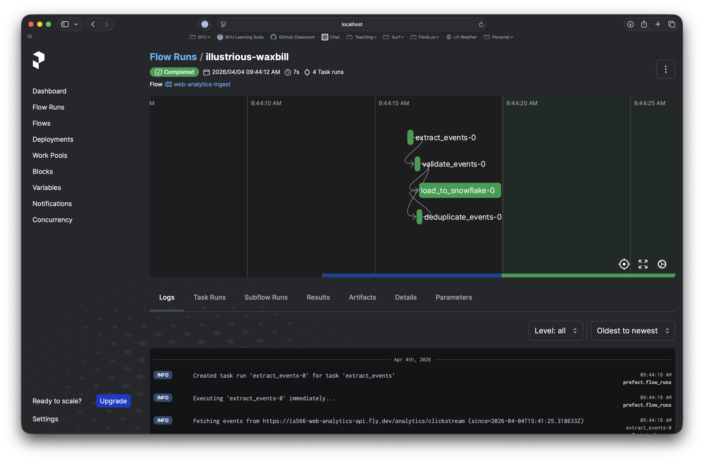
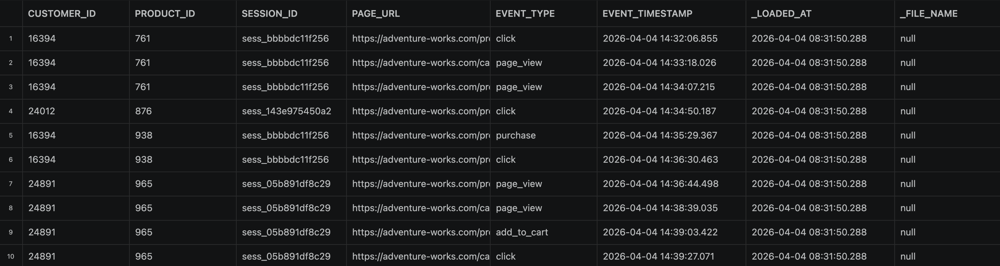

# Final Project // Milestone 2: Data Quality, Orchestration, and Agent-Assisted Development

Welcome back. In Milestone 1, you built a working data pipeline that pulls sales data from PostgreSQL, chat logs from MongoDB, loads everything into Snowflake, and transforms it with dbt. That was a real accomplishment, and it gave you a solid foundation.

Now we're going to build on top of it. Milestone 2 adds three things to your data platform:

1. **A new data source.** Adventure Works wants to understand customer browsing behavior on its website. We'll pull web analytics (clickstream) data from a REST API and land it in Snowflake.
2. **Orchestration with Prefect.** Instead of running a Python script manually, we'll use Prefect (remember Assignment 8?) to orchestrate the new pipeline with scheduling, retries, and observability.
3. **Data quality infrastructure.** We'll add dbt tests and source freshness checks so that bad data gets caught instead of silently corrupting your warehouse.

There's one more twist: you'll build the Prefect flow using an AI agent. Not because the agent will do better work than you can, but because learning to work effectively with AI tools is a skill that every data engineer needs right now. You'll write a requirements document first, hand it to an agent, review what it generates, fix what's broken, and document the entire process.

By the end of this milestone, you'll have three data sources flowing through your pipeline, comprehensive testing, and a production-grade deployment via dbt Cloud. That's a real data platform, and it's something worth talking about in interviews.

Okay. Let's get to it.

---

## Before You Begin

Make sure you have the following from Milestone 1:

- [ ] Your Docker Compose environment was successfully tested (but you don't have to leave it running!)
- [ ] Your processor has successfully loaded data into Snowflake
- [ ] Your dbt models are building and your dashboard is working
- [ ] Your repository is committed and pushed to GitHub

> [!IMPORTANT]
> If your Milestone 1 pipeline is not working, fix it first. Milestone 2 builds directly on top of it. Everything we do here assumes your Snowflake raw tables are populated and your dbt models are running.

Here is an updated system overview showing where the new Milestone 2 components fit:

```
                                ┌───────────────────┐
                                │   REST API        │
                                │  (Web Analytics)  │  <-- NEW (Milestone 2)
                                └────────┬──────────┘
                                         │
┌──────────────┐                         │                     ┌──────────────┐
│  PostgreSQL  │──┐                      │                     │  dbt Cloud   │
│  (Sales)     │  │    ┌─────────────────┼────────────┐        │  (CI/CD)     │
└──────────────┘  ├──> │   Snowflake Warehouse        │ <──────│              │
┌──────────────┐  │    │                              │        └──────────────┘
│  MongoDB     │──┘    │  RAW_EXT (raw tables)        │
│  (Chat Logs) │       │    ├── orders_raw            │
└──────────────┘       │    ├── chat_logs_raw         │
                       │    ├── web_analytics_raw  ◄──── NEW
       Prefect ──────> │                              │
       (orchestrates   │                              │
        API ingestion) │  dbt (staging + intermediate)│
                       │    ├── stg_web_analytics  ◄──── NEW
                       │    └── int_web_analytics  ◄──── NEW
                       └──────────────────────────────┘
```

---

## Task 1: Write a Product Requirements Document (PRD)

Before you write a single line of code (or ask an agent to write one for you), you need to think through what you're building. In the professional world, this is called a Product Requirements Document, and it's how engineers communicate what they need to build, why, and how they'll know it's done.

This matters because AI agents are only as good as the instructions you give them. A vague prompt produces vague code. A detailed PRD produces something much closer to what you actually need.

### 1.1 Understand the Business Context

Adventure Works currently has sales and customer data in the warehouse, but no visibility into what customers are doing on the website before they buy. Web analytics data (page views, clicks, add-to-cart events) would let analysts connect browsing behavior to purchasing patterns.

### 1.2 Explore the API

The web analytics data comes from a REST API. Before writing your PRD, you need to understand the data contract. Start by browsing to the base URL — it has a landing page that explains the scenario and links to everything you need:

**API Base URL:** `https://is566-web-analytics-api.fly.dev`

From the landing page you can reach:

| Page | What it gives you |
|------|-------------------|
| **Landing page** (`/`) | The scenario, quick-start examples, endpoint table, and event schema |
| **Interactive docs** (`/docs`) | Swagger UI — explore endpoints, see schemas, and try requests live in your browser |
| **Agent reference** (`/agent-docs`) | Plain-text markdown designed to paste into an AI coding agent's context |
| **Example event** (`/example`) | A single event — quick way to inspect the data shape |
| **Clickstream data** (`/analytics/clickstream`) | The actual data endpoint your flow will call |

Set `API_BASE_URL=https://is566-web-analytics-api.fly.dev` in your `.env` file (uncomment the Milestone 2 section).

> [!TIP]
> Start at the landing page to understand the scenario and data shape. Then open `/docs` to try the clickstream endpoint interactively — experiment with the `since` parameter to see how incremental pulls work. When you're ready to write your PRD, you can have your agent explore the `/agent-docs` page so it can understand field types, value ranges, and loading strategy. Your PRD should be based on what you (and/or your agent) discover here.

### 1.3 Complete the PRD Template

Open `templates/m2/prd_template.md`. This is a structured template with eight sections. Fill in each section based on what you learned from exploring the API. Save your completed document as `prefect/prd.md` (rename from the template). You'll use this to drive your implementation in Task 2. 

Your Prefect flow must:

1. **Pull clickstream events** from the web analytics API. Handle HTTP errors, rate limits (429), and timeouts with retries and backoff.
2. **Clean and validate** the data. Cast types, handle nulls, and deduplicate records.
3. **Stage cleaned data** in a Snowflake internal stage (the stage DDL is in `prefect/snowflake_objects.sql`).
4. **Load into a raw table** using Snowflake's COPY INTO command.
5. **Clean up staged files** after a successful load.
6. **Log summary statistics**: records fetched, cleaned, and loaded.

The flow should use Prefect 2.0 tasks and flows, connect to Snowflake using environment variables from `.env`, and be deployable via the Docker Compose services already defined in `compose.yml`. Note also that the API has an `/agent-docs` endpoint that returns a markdown document designed to be pasted directly into an AI agent's context. 

> [!TIP]
> Don't rush this. A well-written PRD saves you time later. Spend 20-30 minutes thinking through the acceptance criteria and edge cases. You can use an agent to help you brainstorm about things you aren't thinking of, ask it to interview you to exlore the use case, and otherwise build out a full, comprehensive plan for this component of the system. Make sure that the PRD accounts for the API structure and interaction pattern, that it specifies where it should be adding code, that it is going to be running inside of the docker compose environment using variables from the `.env` file, and everything else relevant to this development task.

---

## Task 2: Build Your Prefect Flow

This is **spec-driven development**: you wrote the spec (your PRD), and now you build to that spec. The flow file at `prefect/flows/web_analytics_flow.py` is intentionally nearly empty — you're creating the architecture and implementation from scratch.

> [!IMPORTANT]
> It's a good idea to **save and commit your changes locally** before you ask your agent to build anything out. If your agent does something unexpected that you didn't intend, you can always revert those changes and try again.

### 2.1 Build It

Open up the `agent_log_template.md` document and save a renamed copy to `prefect/agent_log.md`. You'll be filling this out as you build so that later (in Milestone 3) you can produce a recruiter-facing demonstration of your ability to interact with AI agents to do meaningful work. Don't worry too much about having your log be perfect or fully coherent; we'll refine it later. The goal is to capture your process so that you can remember what you did and how you interacted with the agent.

Now you cans hare your PRD and the API docs with your agent, ask it to build the flow, then review and iterate. Document the process in the agent log.

> [!IMPORTANT]
> Even though your agent is doing the building, **you are responsible for the final result**. Understand every line of code in your flow. Do not blindly accept AI-generated code. AI agents frequently get Snowflake-specific syntax wrong (they default to PostgreSQL patterns) and miss edge cases in error handling. Review everything.

### 2.2 Test Your Flow

Verify your flow works end-to-end:

1. **Syntax check**: Make sure the flow imports cleanly:
   ```bash
   cd prefect
   uv run python -c "from flows.web_analytics_flow import web_analytics_flow; print('Import OK')"
   ```

2. **Local run**: Run the flow directly to test against the live API:
   ```bash
   uv run python -m flows.web_analytics_flow
   ```

3. **Docker run**: Uncomment the Prefect services in `compose.yml` (prefect-server, prefect-worker, web-analytics-flow) and start them:
   ```bash
   docker compose up --build -d prefect-server prefect-worker web-analytics-flow
   docker compose logs -f web-analytics-flow
   ```

4. **Verify in Snowflake**: Check that data landed in `RAW_EXT.web_analytics_raw`:
   ```sql
   SELECT COUNT(*), MIN(event_timestamp), MAX(event_timestamp) FROM RAW_EXT.web_analytics_raw;
   ```

Assuming your agent did its job, you should be able to access the prefect environment from `http://localhost:4200` and see that flows have run. I'll show a screenshot of what mine looked like, but of course yours might be very different because our agents will build things in their own way.



What the flow is producing in Snowflake, however, will be more deterministic. You should be able to run some test queries (including the count query in #4 above) to see data flowing into the `WEB_ANALYTICS_RAW` table. Here's what my data from that table looks like (with a SELECT *, limit 10 query):



Poke around a bit to make sure you're comfortable with what your agent built, and to be sure that data is flowing all the way from API to Snowflake.

> [!IMPORTANT]
> 📷 Grab two screenshots: one of your own prefect flow having run successfully, and another of your `WEB_ANALYTICS_RAW` table populated from your prefect flow. Save these screenshots as `m2_task2.3a.png` and `m2_task2.3b.png`, respectively, to the `screenshots` folder in the assignment repository.

### 2.3 Document Your Process

Use `prefect/agent_log.md` to document your development process: what worked, what didn't, what you'd do differently.

---

## Task 3: Integrate Web Analytics Data into dbt

Now that your Prefect flow is loading data into `RAW_EXT.web_analytics_raw`, we need to bring it into the dbt layer. In Assignment 9, we learned dbt fundamentals. Now we're adding a new data source to our dbt project and following the same staging-to-intermediate patterns you've already built.

### 3.1 Create the Snowflake Objects

Before dbt can reference your web analytics data, the raw table and stage need to exist in Snowflake. Open `prefect/snowflake_objects.sql` and run all three statements in a Snowflake worksheet:

```sql
-- Creates the internal stage and raw table
-- See prefect/snowflake_objects.sql for the full DDL
```

Verify the objects were created:

```sql
SHOW TABLES IN SCHEMA RAW_EXT;
SHOW STAGES IN SCHEMA RAW_EXT;
```

### 3.2 Create the dbt Source Definition

Create `dbt/models-m2/staging/web_analytics/sources.yml`. This file should define `web_analytics_raw` as a dbt source, with column descriptions and tests. It should also configure source freshness (we'll use that in Task 4).

Include a `relationships` test on `customer_id` that links back to your existing `stg_adventure_db__customers` model. This is how dbt validates referential integrity across your data sources.

### 3.3 Create the Staging Model

Create `dbt/models-m2/staging/web_analytics/stg_web_analytics.sql`. Your staging model should:

- Pull from the `raw_ext.web_analytics_raw` source
- Cast columns to consistent types
- Normalize timestamps to UTC
- Add `dbt_loaded_at` metadata

Use your existing staging models (like `stg_adventure_db__customers.sql`) as a reference. Follow the same pattern: source CTE, cleaning CTE, final select.

### 3.4 Create the Intermediate Model

Create `dbt/models-m2/intermediate/int_web_analytics_with_customers.sql`. This model should join your web analytics data with customer attributes from Milestone 1. After this model runs, you'll be able to answer questions like "Which customers from the US viewed the most product pages?"

### 3.5 Register the New Model Path

Your M2 models live in `dbt/models-m2/`, but dbt only knows about directories listed in `dbt_project.yml`. Open `dbt/dbt_project.yml` and add `"models-m2"` to the `model-paths` list:

```yaml
model-paths: ["models-m1", "models-m2"]
```

Without this change, `dbt build` won't discover your new models.

### 3.6 Build and Verify

Run dbt to build the new models:

```bash
dbt build --select stg_web_analytics int_web_analytics_with_customers
```

> [!IMPORTANT]
> If `dbt build` fails with "source not found", make sure you've run the DDL from Step 3.1 and that your Prefect flow has loaded at least one batch of data into `web_analytics_raw`. dbt can't build from an empty source.

Verify your models in Snowflake:

```sql
SELECT COUNT(*) FROM dbt.stg_web_analytics;
SELECT * FROM dbt.int_web_analytics_with_customers LIMIT 10;
```

> [!IMPORTANT]
> 📷 Grab a screenshot of your Snowflake raw table showing sample web analytics data. Save this screenshot as `m2_task3.6a.png` (or jpg) to the `screenshots` folder in the assignment repository.

> [!IMPORTANT]
> 📷 Grab a screenshot of `dbt build` output showing the new models created successfully. Save this screenshot as `m2_task3.6b.png` (or jpg) to the `screenshots` folder in the assignment repository.

**Deliverables:** New dbt models, updated sources.yml

---

## Task 4: Add Data Quality Checks

We've been testing our models since Assignment 10. In this milestone, we're expanding those tests to cover our new web analytics data and adding source freshness checks. Data quality is not optional on a real data team. Bad data that slips through undetected will show up in dashboards, confuse analysts, and erode trust in the data platform.

### 4.1 Add Generic Tests to Web Analytics Models

The source and model YAML files already include tests for the critical columns:

- `not_null` on customer_id, product_id, session_id, event_timestamp
- `accepted_values` on event_type
- `relationships` on customer_id (linking to customers)

Review these in `sources.yml`, `stg_web_analytics.yml`, and `int_web_analytics_with_customers.yml`. Make sure you understand what each test does and why it matters.

### 4.2 Configure Source Freshness

The `sources.yml` file includes freshness configuration:

```yaml
freshness:
  warn_after: {count: 12, period: hour}
  error_after: {count: 24, period: hour}
loaded_at_field: event_timestamp
```

This tells dbt to check the most recent `event_timestamp` in the raw table. If no events are newer than 12 hours, dbt warns; if the gap exceeds 24 hours, it errors. We use `event_timestamp` (not `_loaded_at`) because `COPY INTO` with column count mismatch doesn't populate DEFAULT values for missing columns. The thresholds are set wide enough to handle timezone differences and periods when your Prefect flow isn't running. Run the freshness check:

```bash
dbt source freshness
```

You should see output showing the freshness status of your web analytics source (and any other sources that have `loaded_at_field` configured).

### 4.3 Implement Custom Tests

Two custom test files are provided in `templates/m2/` (copy them to `dbt/tests/` when you begin M2):

1. **`web_analytics_row_count_minimum.sql`** - Already implemented. Verifies that `stg_web_analytics` has at least 50 rows. A simple smoke test to catch empty tables.

2. **`web_analytics_freshness_check.sql`** - This one has a `TODO` for you. Implement the SQL that checks whether the most recent `event_timestamp` in `stg_web_analytics` is within 4 hours. The comments in the file explain what to do.

> [!TIP]
> Use Snowflake's `DATEDIFF` function and `MAX` aggregate. The test should return rows only when data is stale (that's how dbt custom tests work: returning rows means failure).

### 4.4 Add Error Handling to Your Prefect Flow

If you haven't already (from Task 2), make sure your Prefect flow includes:

- **Try/except blocks** around API calls and Snowflake operations
- **Logging** at each major step (with record counts, not just "step completed")

### 4.5 Run All Tests

```bash
dbt test
```

Review the output. All tests should pass. If any fail, read the error message carefully. It tells you exactly what went wrong.

> [!IMPORTANT]
> 📷 Grab a screenshot of `dbt test` output with all tests passing. Save this screenshot as `m2_task4.5a.png` (or jpg) to the `screenshots` folder in the assignment repository.

> [!IMPORTANT]
> 📷 Grab a screenshot of `dbt source freshness` output. Save this screenshot as `m2_task4.5b.png` (or jpg) to the `screenshots` folder in the assignment repository.

**Deliverables:** Custom test implementation, source freshness configuration

---

## Task 5: Set Up dbt Cloud

Until now, you've been running dbt from the command line. That works for development, but in production, you need automated scheduling, CI/CD on pull requests, and a UI for monitoring job runs. That's what dbt Cloud provides.

Follow the step-by-step instructions in `templates/m2/dbt_cloud_setup.md` to:

### 5.1 Replace Your Lab Project

You already have a dbt Cloud account from the earlier lab assignment. Delete your old lab project (free tier only allows one), then create a new project connected to your `is-566-11-final-project` repo with the subdirectory set to `dbt/`.

### 5.2 Verify Snowflake Connection

Your Snowflake credentials should carry over. Test the connection and set the production schema to `dbt_prod`.

### 5.4 Create a Scheduled Job

Set up a job called "Scheduled dbt Build" that runs `dbt build` on a schedule (daily or hourly).

### 5.5 Create a CI/CD Job

Set up a second job called "CI - Pull Request Tests" that runs `dbt build` on every pull request.

### 5.6 Verify Everything Works

Manually trigger your scheduled job and confirm it completes successfully. Then create a test branch, push a small change, and open a pull request to verify the CI job runs.

> [!IMPORTANT]
> The `templates/m2/dbt_cloud_setup.md` file has detailed instructions for each step, including troubleshooting tips for common issues. Follow it carefully and take screenshots at each checkpoint.

> [!IMPORTANT]
> 📷 Grab a screenshot of your dbt Cloud project dashboard. Save this screenshot as `m2_task5.6a.png` (or jpg) to the `screenshots` folder in the assignment repository.

> [!IMPORTANT]
> 📷 Grab a screenshot of a successful scheduled job run. Save this screenshot as `m2_task5.6b.png` (or jpg) to the `screenshots` folder in the assignment repository.

> [!IMPORTANT]
> 📷 Grab a screenshot of a pull request with the CI job running. Save this screenshot as `m2_task5.6c.png` (or jpg) to the `screenshots` folder in the assignment repository.

**Deliverables:** Completed `templates/m2/dbt_cloud_setup.md` with evidence, working scheduled and CI jobs

---

## Task 6: Documentation, Reflection, and Portfolio Updates

This is the part where you step back and look at what you've built. By the end of this task, your repository should tell a clear story to anyone who opens it.

### 6.1 Finalize Your Agent Log

Review `prefect/agent_log.md`. Make sure every section is filled in with honest, specific reflections. This is a learning artifact. I'm not grading you on whether the agent worked perfectly. I'm looking at whether you can articulate what happened, what you learned, and how you'd approach it differently next time.

### 6.2 Update Your Architecture Diagram

Update your README to reflect the new components from Milestone 2 (you'll create a proper architecture diagram in Milestone 3):

- REST API as a new data source
- Prefect as the orchestration layer for web analytics
- Web analytics raw, staging, and intermediate tables
- dbt Cloud as the scheduled build and CI/CD system

You can use any diagramming tool (draw.io, Excalidraw, Mermaid, or even ASCII art like the one at the top of this README).

### 6.3 Update Your README

Add a "Milestone 2" section to your README that covers:

- What you built and why
- The three data sources now flowing through your pipeline
- Your data quality strategy (tests, freshness checks)
- A link to your agent log with a brief summary of the experience
- Updated setup instructions (new environment variables, Prefect services)

### 6.4 Review Your .env.sample

Open `.env.sample` and verify that all new environment variables are documented:

- `API_BASE_URL`
- `PREFECT_API_URL`
- `FLOW_SCHEDULE_MINUTES`

### 6.5 Clean Up and Commit

Review your full repository. Make sure:

- No credentials are committed (check `.gitignore`)
- No unnecessary files are hanging around
- Your commit messages describe what and why, not just "updated files"

```bash
git add -A
git commit -m "Milestone 2: Add web analytics pipeline, dbt quality checks, and dbt Cloud integration"
git push
```

> [!IMPORTANT]
> 📷 Grab a screenshot of your completed agent log. Save this screenshot as `m2_task6.5.png` (or jpg) to the `screenshots` folder in the assignment repository.


**Deliverables:** Completed `prefect/agent_log.md`, updated README with Milestone 2 section and architecture diagram, clean Git history

---

## What You've Accomplished

Take a moment to appreciate what you have now. Your data platform ingests from three sources (PostgreSQL, MongoDB, REST API), orchestrates ingestion with Prefect, lands raw data in Snowflake, transforms it through staging and intermediate layers with dbt, validates quality with automated tests and freshness checks, and deploys to production with dbt Cloud scheduling and CI/CD.

That's not a homework assignment. That's a data platform. And you built it.

Milestone 3 will add the final layer: exposing your data models to AI agents through a dbt MCP server, finalizing your portfolio documentation, and polishing everything so it's ready to show in interviews.

See you there.

---

## Quick Reference: New Files in Milestone 2

| File | Purpose |
|------|---------|
| `prefect/flows/web_analytics_flow.py` | Prefect flow for API ingestion |
| `prefect/prd.md` | Your completed PRD (from template) |
| `prefect/agent_log.md` | Your agent interaction log (from template) |
| `prefect/Dockerfile` | Docker image for Prefect flow |
| `prefect/pyproject.toml` | Python dependencies for Prefect |
| `prefect/snowflake_objects.sql` | DDL for raw table and stage |
| `dbt/models-m2/staging/web_analytics/sources.yml` | dbt source definition with freshness and tests |
| `dbt/models-m2/staging/web_analytics/stg_web_analytics.sql` | Staging model for web analytics |
| `dbt/models-m2/intermediate/int_web_analytics_with_customers.sql` | Intermediate model joining with customers |
| `templates/m2/web_analytics_row_count_minimum.sql` | Custom test: minimum row count (copy to `dbt/tests/`) |
| `templates/m2/web_analytics_freshness_check.sql` | Custom test: data freshness — you implement (copy to `dbt/tests/`) |
| `templates/m2/dbt_cloud_setup.md` | Step-by-step dbt Cloud configuration guide |
| `compose.yml` | Updated with Prefect services |
| `.env.sample` | Updated with new environment variables |

---

## Troubleshooting

**Prefect server not starting:**
- Check that port 4200 is not already in use: `lsof -i :4200`
- Review Prefect server logs: `docker compose logs prefect-server`

**Prefect flow hangs or can't connect:**
- Verify `PREFECT_API_URL` is set to `http://prefect-server:4200/api` in the container environment
- Make sure the Prefect server is healthy before starting the flow: `docker compose ps`

**dbt source freshness fails:**
- This is expected if you haven't loaded any data recently. Run your Prefect flow first, then check freshness again.
- If freshness is stale even after loading data, check that `event_timestamp` values are recent in your raw table. Note that `event_timestamp` is stored as `TIMESTAMP_NTZ` in UTC — if your Snowflake session uses a different timezone, the comparison may be off by your UTC offset.

**dbt test failures:**
- Read the error message. It tells you the model, column, and test that failed.
- `relationships` test failures often mean your web analytics data has customer_id values that don't exist in the customer table. This can happen if your data generator and API produce different ID ranges.

**Docker Compose networking issues:**
- All services are on the default Docker Compose network. Service names (e.g., `prefect-server`, `postgres`) resolve as hostnames automatically.
- If you're running dbt locally (not in Docker), use `localhost` instead of service names.
